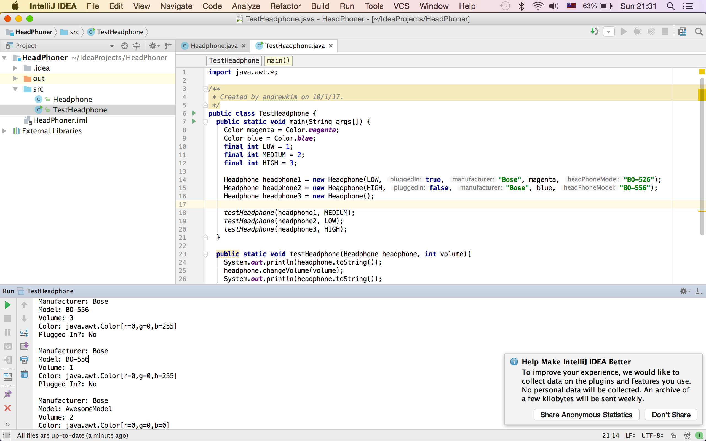
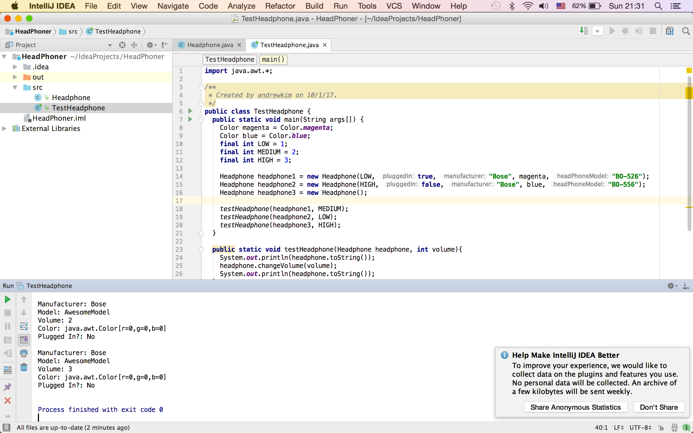

# Homework 2

## Test Case 1 - Passed

### Input
> Headphone was created using the following java code

```java
Color magenta = Color.magenta;
Headphone headphone1 = new Headphone(LOW, true, "Bose", magenta, "BO-526");
```

- Volume: Low
- Is plugged in: true
- manufacturer: Bose
- model: BO-526
- color: magenta

### Expected Output
```
Model: BO-526
Volume: 1
Color: java.awt.Color[r=255,g=0,b=255]
Plugged In?: Yes

Manufacturer: Bose
Model: BO-526
Volume: 2
Color: java.awt.Color[r=255,g=0,b=255]
Plugged In?: Yes
```

### Actual Output
```
Model: BO-526
Volume: 1
Color: java.awt.Color[r=255,g=0,b=255]
Plugged In?: Yes

Manufacturer: Bose
Model: BO-526
Volume: 2
Color: java.awt.Color[r=255,g=0,b=255]
Plugged In?: Yes
```
### Screenshot


## Test Case 2 - Passed

### Input

> Headphone was created using the following java code

```java
Color blue = Color.blue;
Headphone headphone2 = new Headphone(HIGH, false, "Bose", blue, "BO-556");
```

- Volume: High
- Is plugged in: false
- manufacturer: Bose
- model: BO-556
- color: blue

### Expected Output
```
Manufacturer: Bose
Model: BO-556
Volume: 3
Color: java.awt.Color[r=0,g=0,b=255]
Plugged In?: No

Manufacturer: Bose
Model: BO-556
Volume: 1
Color: java.awt.Color[r=0,g=0,b=255]
Plugged In?: No
```

### Actual Output
```
Manufacturer: Bose
Model: BO-556
Volume: 3
Color: java.awt.Color[r=0,g=0,b=255]
Plugged In?: No

Manufacturer: Bose
Model: BO-556
Volume: 1
Color: java.awt.Color[r=0,g=0,b=255]
Plugged In?: No
```

### Screenshot



## Test Case 3 - Passed

### Input

> Headphone was created using the following java code

```java
Headphone headphone3 = new Headphone();
```

> No inputs were used to test default scenarios

### Expected Output
```
Manufacturer: Bose
Model: AwesomeModel
Volume: 2
Color: java.awt.Color[r=0,g=0,b=0]
Plugged In?: No

Manufacturer: Bose
Model: AwesomeModel
Volume: 3
Color: java.awt.Color[r=0,g=0,b=0]
Plugged In?: No
```

### Actual Output
```
Manufacturer: Bose
Model: AwesomeModel
Volume: 2
Color: java.awt.Color[r=0,g=0,b=0]
Plugged In?: No

Manufacturer: Bose
Model: AwesomeModel
Volume: 3
Color: java.awt.Color[r=0,g=0,b=0]
Plugged In?: No
```

### Screenshot

